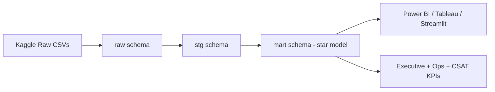

# Olist E-commerce Consumer Insights & Operations Dashboard

Author: **Ao Xu**  
Dataset: **Kaggle - Brazilian E-Commerce Public Dataset by Olist**  

## Objective

**Objective: To design a single-source-of-truth data warehouse and analytical dashboard for Olist to improve supply chain efficiency and consumer satisfaction.**

This project demonstrates end-to-end analytics delivery:
- multi-source data integration (9 CSV files),
- warehouse modeling (star schema),
- ETL pipeline implementation,
- executive dashboard design (Power BI / Tableau / Streamlit Web),
- and data quality validation.

## Why This Project Matters

The Olist dataset is ideal for showcasing practical analytics skills because it includes:
- real-world order, payment, logistics, and review events,
- fragmented source tables (simulating data silos),
- direct links between operations and customer experience.

It supports both:
- **PE/executive questions** (growth, revenue quality, operational risk), and
- **consumer/operations questions** (delivery delays, freight pressure, review degradation).

## Architecture Overview



### Warehouse Layers

- `raw`: direct landing tables from CSV.
- `stg`: typed/cleaned staging models + reusable aggregates.
- `mart`: dimensions, fact tables, and dashboard-ready semantic views.

## Star Schema (Core)

### Fact tables
- `mart.fact_orders` (order grain):  
  GMV, freight, payment installments, delivery days, delay days, review score, late-delivery flags.
- `mart.fact_order_items` (order-item grain):  
  product category and contribution proxy analytics.

### Dimensions
- `mart.dim_customer`: city/state + zip + geo coordinates.
- `mart.dim_product`: translated product category + size/weight attributes.
- `mart.dim_time`: full calendar for purchase/approved/delivered dates.
- `mart.dim_review`: review score and comment metadata.
- `mart.dim_seller`: seller location context for operations analysis.

## Dashboard Tabs (Business Storyline)

1. **Executive Summary**
   - KPIs: GMV, Order Count, AOV, YoY Order Growth.
   - Insights: category contribution proxy, payment method mix.

2. **Supply Chain & Operations**
   - KPIs: Avg Delivery Days, On-Time Rate, Freight/GMV Ratio.
   - Insights: state-level delay bottlenecks and severe delay rate.

3. **Customer Satisfaction**
   - KPIs: review distribution, one-star rate, low-score rate.
   - Insights: delay bucket vs review score (especially `>5 days late` bucket impact).

## Repository Structure

```text
.
├── data/
│   ├── README.md
│   ├── raw/                  # put Kaggle CSV files here (ignored in git)
│   ├── warehouse/            # DuckDB file output (ignored in git)
│   └── exports/              # mart export files for BI (ignored in git)
├── ETL_Scripts/
│   ├── README.md
│   ├── requirements.txt
│   ├── run_pipeline.py
│   ├── validate_warehouse.py
│   └── sql/
│       ├── 10_staging.sql
│       ├── 20_dimensions.sql
│       ├── 30_facts.sql
│       ├── 40_dashboard_views.sql
│       └── 50_quality_checks.sql
├── Dashboard/
│   ├── README.md
│   ├── kpi_dictionary.md
│   ├── powerbi_build_guide.md
│   ├── tableau_build_guide.md
│   ├── mockup_layout.md
│   └── screenshots/
├── web_dashboard/
│   ├── app.py
│   ├── README.md
│   └── requirements.txt
├── web_dashboard_static/
│   ├── index.html
│   ├── app.js
│   ├── styles.css
│   ├── generate_data.py
│   ├── data/dashboard_data.json
│   └── README.md
├── docs/
│   ├── interview_talk_track.md
│   └── scale_up_plan.md
├── requirements.txt
└── tests/
    ├── run_smoke_test.py
    └── fixtures/olist_sample_raw/
```

## Quick Start

1. Download Olist dataset from Kaggle and unzip CSVs into `data/raw/`.
2. Create env and install dependencies:

```bash
python3 -m venv .venv
source .venv/bin/activate
python3 -m pip install -r ETL_Scripts/requirements.txt
```

3. Run the warehouse pipeline:

```bash
python3 ETL_Scripts/run_pipeline.py \
  --raw-dir data/raw \
  --db-path data/warehouse/olist.duckdb \
  --export-dir data/exports
```

4. Validate warehouse integrity:

```bash
python3 ETL_Scripts/validate_warehouse.py --db-path data/warehouse/olist.duckdb
```

5. Connect Power BI / Tableau to:
- `data/warehouse/olist.duckdb`, or
- exported mart files under `data/exports/`.

6. Run online website dashboard (Streamlit):

```bash
python3 -m pip install -r requirements.txt
python3 -m streamlit run web_dashboard/app.py
```

7. Deploy online:
- See `web_dashboard/README.md` for Streamlit Community Cloud steps.
- You can also use root entrypoint `streamlit_app.py` for faster auto-detection.

## Streamlit Access Blocked? Use Static CDN Dashboard

If your network shows `source IP address not allowed` for Streamlit Cloud, use the static public dashboard:

```text
https://cdn.jsdelivr.net/gh/bobaoxu2001/Olist-Dashboard@main/web_dashboard_static/index.html
```

If cached `@main` is stale, switch to commit-pinned URL:

```text
https://cdn.jsdelivr.net/gh/bobaoxu2001/Olist-Dashboard@<commit_sha>/web_dashboard_static/index.html
```

To refresh with latest warehouse metrics:

```bash
python3 web_dashboard_static/generate_data.py \
  --db-path data/warehouse/olist.duckdb \
  --output-path web_dashboard_static/data/dashboard_data.json
```

The static dashboard supports advanced interactions:
- Daily / Monthly / Yearly granularity switch,
- Global date range filtering,
- State and payment-type multi-select filters,
- Top/Bottom N controls for ranking charts,
- Storyline shortcut buttons for guided demos,
- Drilldown tables from category/state/heatmap clicks,
- Dynamic KPI and insight recalculation across all tabs.

## Cloud Agent Environment

This repo includes `.cursor/environment.json` so new cloud agents bootstrap with:
- `duckdb`
- `pandas`
- `pyarrow`
- `kaggle`

That means `ETL_Scripts/run_pipeline.py` and `ETL_Scripts/validate_warehouse.py` can run without extra package setup on new agents.

## If You Need More Data Scale

See `docs/scale_up_plan.md` for real data extensions:
- Olist Marketing Funnel / Closed Deals datasets (seller-side growth funnel),
- Brazilian state/city macro datasets (population, inflation, fuel price proxies),
- holiday/event calendars for delivery stress seasonality modeling.